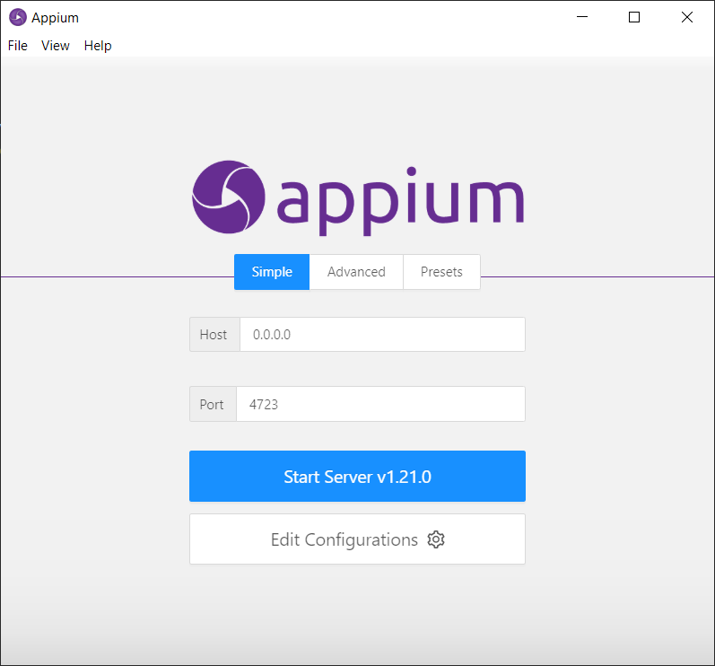
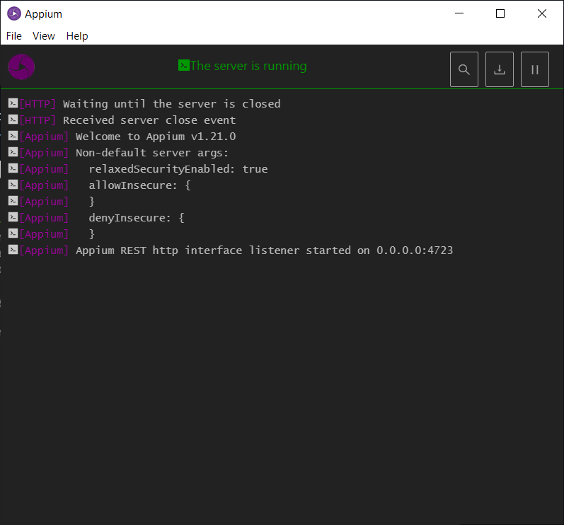

# Discover Appium desktop 

In the [previous section] (. /install_appium. MD) we installed appium, assume that every thinks goes find for you, lest now discover and start using opium desktop.

## Run Appium desktop

runnig appium desktop from desktop icon, you should have the sceen above 

on this image we have two important information, the http server and the port. like appium is base on client server architecture, appium desktop is the client and we should specifie the server. In our the server is runing on our computer why we have 0.0.0.0 = localhost ass the server address, on the port 4723. Run start server and we have
 

The server is now running
