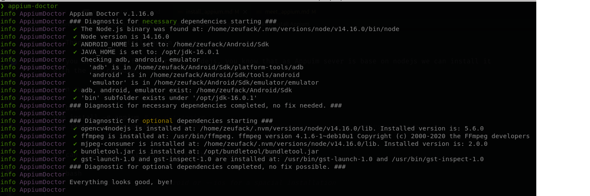

# Install [Appuim](./meet_appium.md)

As Appuim is cross platform, it is available for both windows, linux and iOS, let us see
how to install it on defferent operating system start with linux then windows and mac os

## Prerequisites

This installation assume you already have the following dependencies :package: :

- NodeJs and npm\*
- JDK(Java Development Kit)\*
- Android Studio\*
- Your favorite Editor\*
- opencv

\* are required packages

### Environment variables

Appuim desktop use some enviroment variables; then we should set them:

copy and paste this in to you .bashrc for Linux user and bash_profile for mac user

```bash
# set ANDROI_HOME paht, you can get android sdk by installin Android studio
export ANDROID_HOME=/your/path/to/Android/sdk
# set sub folder of ANDROID_HOME to make some utilities like adb available from command line
export PATH=$ANDROID_HOME/platform-tools:$PATH
export PATH=$ANDROID_HOME/tools:$PATH
export PATH=$ANDROID_HOME/build-tools:$PATH
# set J
export JAVA_HOME=/your/path/to/jdk/Contents/Home
export PATH=$JAVA_HOME/bin:$PATH
```

file then
run

```bash
# run from home(~) folder
source .bashrc # for linux user
source ~./bash_profile # for mac user
```

Wher /your/path/to/ is where you have douwload and install the needed tool

for windows user follow this [tutorial](https://java.com/en/download/help/path.html) to set you environment

### Install Appium

1- First of all follow this link to [Download appium](https://github.com/appium/appium-desktop/releases/tag/v1.13.0) desktop
chose the version belong to your operating system and download it

For windows user, just run the .exe file
For linux user:

```bash
# make the Appimage file executable
chmod u+x Appium-linux-1.13.0.AppImage
# then run it
./Appium-linux-1.13.0.AppImage
# then follow the step to install Appium,
```

Get the .dmg file for mac a install it

2- Then let us install Appuim server

if you are already familliar with nodejs, you know that as Appuim sever is base on nodejs we can install it
with the npm command.

then run

```bash
npm install -g appium # to get appium
npm install -g appium-doctor # to get appium doctor that we use to check our installation
```

We can check our installation with the following command

```bash
    appium-doctor # add --android or --ios for a spacial installation
```

the output should be like:


---
