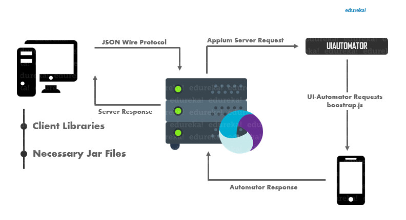
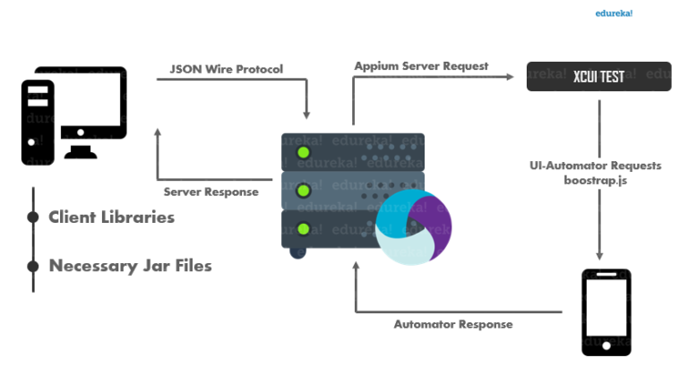
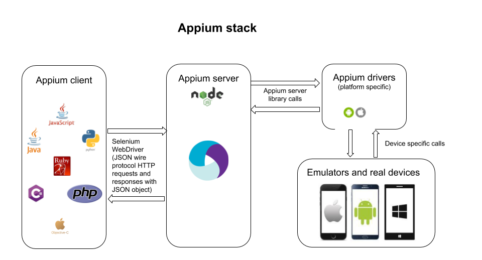

# Introduction

In software engineering, it happens that we need to automate some tasks, very often tests; for the automation of UI tests on mobile applications we use appium. In this note, we will explain our choice for this solution, how to install it and demonstrate some tasks we can do with this tool.

## What is Appuim ?

**Appium** is an open-source tool for test automation on **_native_** application( written with a collection of tools dedicated to a particular plateforme calles **SDKs** like `Android SDK` and `iOS SDK`), **_Hybrid_** appapplication (which are application that cobines elements of both natives applications and web applications) and mobile web application( basicaly web applicaion runing on mobile using browser). Appium is _cross platform_ that mean it allows you to write tests for both Android a iOS using the same API.

### Why Appium ?

the preference for appium comes first of all from the fact that it is open-source but also because of its philosophy based on four principles which I will faithfully reproduce the [documentation](https://appium.io/docs/en/about-appium/intro/):

- You shouldn't have to recompile your app or modify it in any way in order to automate it.
- You shouldn't be locked into a specific language or framework to write and run your tests.
- A mobile automation framework shouldn't reinvent the wheel when it comes to automation APIs.
- A mobile automation framework should be open source, in spirit and practice as well as in name!

### How Appium tool works ?

#### Appium Design

Appium uses the automation tools provided by the designers of the SKDs and combines them into a single webdriver, then exposes **_REST API_** to use this webdriver, the webdriver API. Clients initiate a session with a server by sending the Desire Capabilities which are set of keys values that describe the kind of automation session we are interested in starting up, Automation is always performed in the context of session, the server receives connection from client, listens for commands, executes those command on the mobile device specified by the client and responds with HTTP response.

Appium on Android (black box)from [ [Edukera](https://www.edureka.co/blog/appium-architecture/#appium_architecture) ]

---

Appium on iOS from (black box) [ [Edukera](https://www.edureka.co/blog/appium-architecture/#appium_architecture) ]

---

Appium on Android and iOS from (white box) [ [digital.ai](https://digital.ai/catalyst-blog/comparing-and-combining-web-and-mobile-test-automation-drivers) ]

---

[Next](./install_appium.md)
